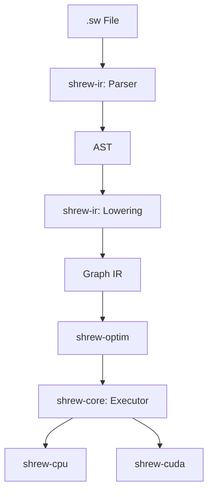

# Architecture Overview

Shrew is built as a modular set of Rust crates. The architecture is designed to separate the frontend language (DSL) from the backend execution engines, with a middle layer for Intermediate Representation (IR) and optimization.

## High-Level Flow

1. **Frontend**: The `shrew-ir` crate parses the `.sw` source code into an Abstract Syntax Tree (AST) and then lowers it into a High-Level IR (Graph).
2. **Optimization**: The `shrew-optim` crate applies graph transformations (e.g., constant folding, operator fusion) to the IR.
3. **Execution**: The `shrew-core` crate orchestrates execution, dispatching tensor operations to specific backends (`shrew-cpu`, `shrew-cuda`).

## Diagram

